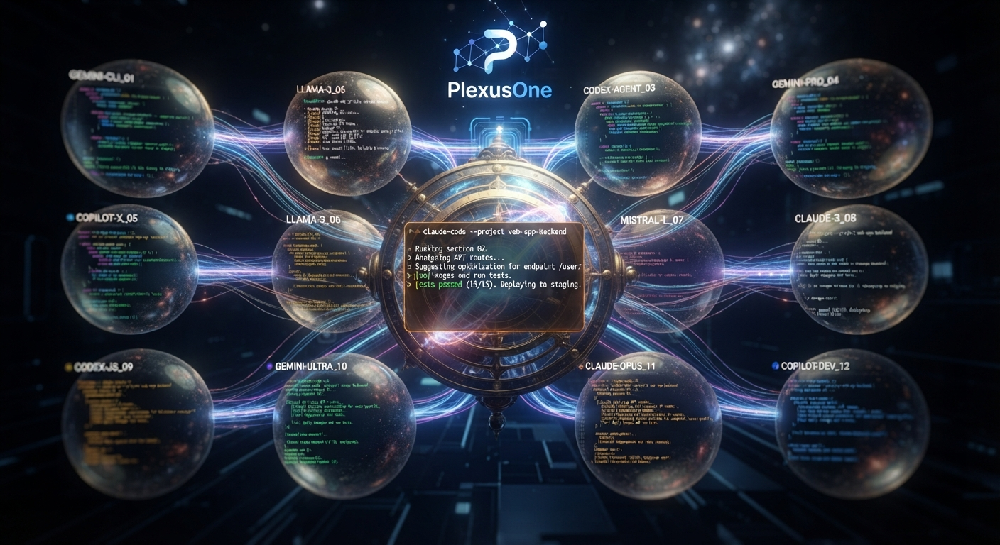

# PlexusOne App

[![Swift CI][swift-ci-svg]][swift-ci-url]
[![License][license-svg]][license-url]

 [swift-ci-svg]: https://github.com/plexusone/plexusone-app/actions/workflows/desktop.yaml/badge.svg?branch=main
 [swift-ci-url]: https://github.com/plexusone/plexusone-app/actions/workflows/desktop.yaml
 [license-svg]: https://img.shields.io/badge/license-MIT-blue.svg
 [license-url]: https://github.com/plexusone/plexusone-app/blob/main/LICENSE

A multi-agent orchestration platform for AI CLI tools like Claude Code and Kiro CLI.

[](https://plexusone.dev/plexusone-app/)

[](https://plexusone.dev/plexusone-app/)

## Repository Structure

```
plexusone-app/
├── apps/
│   ├── desktop/          # macOS app (Swift + SwiftTerm)
│   ├── flutter/          # iOS/Android/web/macOS companion (Flutter)
│   └── ios/              # Native iOS/iPadOS companion (Swift + SwiftTerm)
├── services/
│   └── tuiparser/        # WebSocket bridge for mobile streaming (Go)
└── docs/
    └── design/           # PRDs and design documents
```

## Components

### PlexusOne Desktop (macOS)

Native macOS terminal multiplexer built with Swift and SwiftTerm.

- Multi-window, multi-pane grid layout
- Attach/detach to tmux sessions
- Pop-out sessions to dedicated windows
- **Input detection** for AI assistant prompts (Claude, Kiro, etc.)
- **PTY wrapper detection** - warns if a session is running behind a shell-autocomplete PTY shim (Kiro CLI, Fig, Amazon Q) known to freeze terminal panes
- Visual focus indicator for active pane
- Session state persistence
- 10,000 line scrollback buffer

**Download:** [Releases](https://github.com/plexusone/plexusone-app/releases)

**Build & Run:**
```bash
cd apps/desktop
swift build
open "PlexusOne Desktop.app"
```

### PlexusOne Mobile - Flutter (iOS/Android/Web/macOS)

Cross-platform companion app for monitoring and interacting with agents remotely.

- Terminal-styled output view
- Session tabs
- Quick action buttons (Yes/No/Always)
- Virtual D-pad for menu navigation
- WebSocket connection to TUI Parser

**Build & Run:**
```bash
cd apps/flutter
flutter pub get
flutter run
```

### PlexusOne Mobile - Native iOS

Native iOS/iPadOS companion app using SwiftTerm (same terminal library as Desktop).

**Build & Run:**
```bash
cd apps/ios
xcodebuild -project PlexusOneiOS.xcodeproj \
  -scheme PlexusOneiOS \
  -sdk iphonesimulator \
  -destination 'platform=iOS Simulator,name=iPhone 16 Pro' \
  build
```

### TUI Parser (WebSocket Bridge)

Go service that bridges tmux sessions to mobile clients over WebSocket.

- Attaches to tmux sessions via PTY
- Streams terminal output
- Accepts input/keystrokes from mobile
- Pattern detection for TUI prompts (planned)

**Build & Run:**
```bash
cd services/tuiparser
go build -o bin/tuiparser ./cmd/tuiparser
./bin/tuiparser --port 9600
```

Debug console: http://localhost:9600

## Architecture

```
┌───────────────────────────────────────────────────┐
│  macOS                                            │
│                                                   │
│  ┌─────────────┐     ┌─────────────────────────┐  │
│  │ tmux        │     │ TUI Parser (Go)         │  │
│  │ sessions    │◄───►│ WebSocket server :9600  │  │
│  └─────────────┘     └───────────┬─────────────┘  │
│         ▲                        │                │
│         │                        │                │
│  ┌──────┴──────┐                 │                │
│  │ PlexusOne   │                 │                │
│  │ Desktop     │                 │                │
│  └─────────────┘                 │                │
└──────────────────────────────────┼────────────────┘
                                   │ WebSocket (LAN)
                         ┌─────────▼────────┐
                         │ PlexusOne Mobile │
                         │ (Flutter or iOS) │
                         └──────────────────┘
```

## Documentation

- [Changelog](CHANGELOG.md)
- [Product Requirements](docs/design/prd.md)
- [Technical Requirements](docs/design/trd.md)
- [Mobile App PRD](docs/design/FEAT_MOBILE_PRD.md)
- [AgentPair Integration](docs/design/FEAT_AGENTPAIR_DESIGN.md)
- [AgentSentinel Integration](docs/design/FEAT_SENTINEL_PRD.md)
- [Voice Note Feature](docs/design/FEAT_VOICENOTE_PRD.md)

## Development

### Prerequisites

- macOS 14+
- Xcode 15+ (for Swift development)
- Go 1.22+
- Flutter 3.x
- tmux

### Quick Start

1. Start tmux sessions:
   ```bash
   tmux new-session -d -s agent1
   tmux new-session -d -s agent2
   ```

2. Run TUI Parser:
   ```bash
   cd services/tuiparser && ./bin/tuiparser
   ```

3. Run Desktop App:
   ```bash
   cd apps/desktop && open "PlexusOne Desktop.app"
   ```

4. Run Mobile App (same WiFi network):
   ```bash
   cd apps/flutter && flutter run
   ```

## License

MIT - See [LICENSE](LICENSE)
